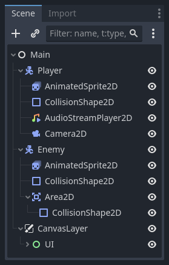

# Themenübersicht
Dieses Halbjahr möchten wir Folgendes machen:
1. [Die Godot-Engine](#die-godot-engine)
2. [Programmiergrundlagen mit GDScript](#programmiergrundlagen-mit-gdscript)
3. Grundlagen von Git
4. [Eigenes Projekt](#eigenes-projekt)
>[!TIP]
> Bei allen Themen gibt es Übungen und eigenes Programmieren, nicht nur beim eigenen Projekt.

# Die Godot Engine
## 1. Was ist Godot und Installation

### Was ist Godot?
Godot ist eine Quelloffene ***Videospiel Engine***. Also ein Werkzeug, welches es ***leichter macht Videospiele zu entwickeln***. Solche Engines sind sinnvoll, damit man nicht für jedes Spiel wichtige Komponenten wie etwa die Physiksimulation oder gar das malen von Pixeln auf den Bildschirm neu implementieren muss.

### Installation
Die Engine kann einfach von https://godotengine.org/ heruntergeladen werden. Die hier heruntergeladene Datei ist eine Portable Executable, was heißt sie muss nicht installiert werden und kann direkt ausgeführt werden.

## 2. Grundkonzepte von Godot
### Nodes
***Nodes sind*** sozusagen die ***Bausteine oder Zutaten*** eines Videospiels in Godot. Sie können verschiedenste Aufgaben erfüllen, wie etwa einen ***Ton abspielen, ein Bild anzeigen*** oder die Spielkamera darstellen. Ähnliche wie Dateien auf einem Computer würde aber ***komplettes Chaos*** enstehen, wenn all diese Nodes frei herumliegen.

### Szenen
Deshalb ***sortiert man sie in Szenen***. Diese funktionieren ***wie Ordner auf einem Computer***. Szenen können dabei wieder alles mögliche sein, von einer einzigen Münze bis zu einem ganzen Level. Deshalb ist ein Spiel in Godot also „ein Baum von Szenen [...] und [...] jede Szene [ist] ein Baum von Nodes“ ([Dokumentation Nodes und Szenen](https://docs.godotengine.org/de/4.x/getting_started/step_by_step/nodes_and_scenes.html)).

In der Praxis sieht das dann zum Beispiel so aus: <br>
 

weitere Informationen über Nodes und Szenen findest du [hier](https://docs.godotengine.org/de/4.x/getting_started/step_by_step/nodes_and_scenes.html) und wichtige Konzepte in Godot [hier](https://docs.godotengine.org/de/4.x/getting_started/introduction/key_concepts_overview.html#doc-key-concepts-overview).

### Signale
Das letzte wichtige Konzept in Godot sind Signale. Mithilfe von Signalen können ***Nodes untereinander kommunizieren ohne das sie im Code fest miteinander verbunden*** sind. Mit ihnen kann man beispielweise feststellen, wenn 2 Objekete aufeinandergestoßen sind. Keine Sorge, falls das jetzt unverständlich klang, die Funktion von Signalen wird weit deutlicher, wenn man sie anwendet.

## 3. Anwendungsbeispiel
Um das gerade Besprochene ein wenig anschaulicher zu machen, werden wir ***jetzt ein kleines Spiel*** programmieren, in welchem wir (das MPG-Logo) auf dem Bildschirm bewegen können.***Keines Sorge, das Programmierte muss man noch nicht verstehen.*** Es geht erst einmal darum die Engine kennenzulernen. Programmiergrundlagen besprechen wir später.

### Hauptszene erstellen
Damit wir anfangen können, müssen wir die gerade gelernten Konzepte gleich anwenden. Zu allererst müssen wir eine `Root Node` erstellen, also eine Wurzel-Node. Diese ist sozusagen der ***Ursprung unseres Spiels*** in welches sich alles andere wie etwa der Spieler befindet.

### Spieler
Da wir ihn gerade erwähnt haben, wäre es jetzt auch passend ihn zu erstellen. Für den Spieler hat Godot einen passenden Node-Typ, nämlich den `Character Body 2D`. <br>
Wenn wir diesen nur aber erstellen, werden wir zunächst ***nichts sehen***. Das liegt daran, dass der Spieler ***noch keinen Sprite*** also noch keine Textur hat. Für den Anfang werden wir dafür einfach das von ein Logo benutzen. Später können wir aber auch unsere eigenen Figuren nehmen. <br>
Zudem braucht der Spieler auch einen `CollisionShape 2D,`also ein Objekt welches ***markiert wie der Spieler physikalisch aussehen sollte***. <br>
Diese beiden Nodes `Collision Shape 2D` und `Sprite 2D` sind nun unter dem `Character Body 2D` wie die Äste eines Baums. Somit ist die Player Node jetzt eine Szene. Damit er auch wirklich in unserem Spiel erscheint müssen wir ihn aber ***noch zur Hauptszene (der „Root Node“ von vorhin) hinzufügen***.

### Inputmap erstellen
In Godot fragt man bei Benutzerinput ***nicht nach einem bestimmten Tastendruck*** (also z.B.: ASCII Codierung) im Code, das übernimmt die Engine, ***sondern*** nach einer "Action", welche man in einer ***Inputmap*** definiert. Diese Inputmap findet man unter `Project > Project Settings > Input Map`. Hierbei kann man die "Action" selbst nennen wie man will und Bedingungen definieren, welche diese "Action" auslösen. Die "Action" "go-right" kann also z.B.: ausgelöst werden wenn der Spieler die rechte Pfeiltaste oder "D" drückt.

### den Spieler bewegen
Godot löst jetzt zwar "Actions" aus, aber ***es passiert nichts*** in unserem Spiel. Das liegt daran, dass wir ***nicht definiert*** haben ***was passieren soll***, wenn diese "Action" ausgelöst wurde. Dies machen wir mit folgendem  Code. <br>
```GDScript
func _process(delta: float) -> void:
	if Input.is_action_pressed("right") == true:
		position = position + Vector2(speed, 0) * delta
```
#### Code-Erklärung
- `_process` ist dabei eine Godot-interne Funktion, die Ähnlich wie `update` bei einem Arduino ständig aufgerufen wird (hier jeden Frame). Zudem sagen wir das bei einem Funktionsaufruf eine Variable namens `delta` weitergegeben werden muss. Diesen Funktionsaufruf machen dabei nicht wir sondern die Engine.
`delta` steht hierbei für die Zeit die seit dem letzen Frame vergangen ist. Dies für die Bewegung hier wichtig, sodass sich der Spieler nicht bei einer höheren Bildrate schneller bewegt.
- Zuletzt bedeutet `void` nur das die Funktion kein "return value" hat.
- Mit `if` schauen wir hier, ob eine Bedingung wahr ist. Man kann also auch schreiben `if Input.is_action_pressed("up") == true:`.
- `Input` ist nun eine Klasse. Das ist ähnlich wie Ordner auf einem Computer nur ein wenig Funktionen zu sortieren. Innerhalb dieser Klasse gibt es nun die Methode (so nennt man Funktionen, die in Klassen sortiert sind) `is_action_pressed()`. Diese sendet an Godot nun die Anfrage, ob eine Taste gedrückt wurde.
- Sollte eine Taste nun gedrückt sein wollen wir den Spieler bewegen. Dies machen wir indem wir die Aktuelle Position des Spielers nehmen und einen Vektor (also eine Verschiebung im Raum) hinzuaddieren.

>[!Tip]
> Wir haben hier jetzt nun einige Funktionen und Variablen gesehen. Diese waren dabei alle von Godot gegeben, weshalb wir sie einfach aufrufen können ohne dem Computer davor sagen zu müssen, was die Funktion eigentlich macht. Nachdem wir Funktionen und Variablen in Kapitel 2 besprochen haben wird das alles klarer.

## 4. Übungsaufgaben
Jetzt, da wir die Grundlagen von Godot kennen, ist es an euch, diese anzuwenden. Hierfür einige Aufgaben (geordnet nach Schwierigkeit und Wichtigkeit):

1.Erstelle weitere "if-Bedingungen" für die anderen Bewegungsrichtungen.
<details>
<summary>Lösung</summary>
<code>func _process(delta: float): <br>
	if Input.is_action_pressed("right") == true: <br>
		&ensp;position = position + Vector2(speed, 0) * delta <br>
	if Input.is_action_pressed("left"): <br>
		&ensp;position += Vector2(-speed, 0) * delta <br>
	if Input.is_action_pressed("up"): <br>
		&ensp;position += Vector2(0, -speed) * delta <br>
	if Input.is_action_pressed("down"): <br>
		&ensp;position += Vector2(0, speed) * delta</code>
</details>

2.Personalisiere deinen Spieler.
<details>
<summary>Lösung</summary>
&emsp; Öffne die Spieler-Szene im <code>Editor</code> (+ Symbol oben rechts oder Symbol, das aussieht, wie eine Filmklappe) <br>
&emsp; Unter <code>Sprite2D</code> klicke auf den Ordner neben <code>Texture</code> <br>
&emsp; Wähle eine Textur (e.g. eine die du aus dem Internet heruntergeladen hast) <br>
</details>

3.Passe die Geschwindigkeit an.
<details>
<summary>Lösung</summary>
&emsp; Klicke auf die Spieler-Szene im <code>Scene-Tree</code> <br>
&emsp; Unter "player.gd" ist die Variable "Speed" änderbar. <br>
</details>

4.Lasse den Spieler auch mittels WASD steuerbar sein.
<details>
<summary>Lösung</summary>
&emsp; Gehe unter <code>Project settings > Input Map</code> <br>
&emsp; Füge zu jeder <code>Action</code> (e.g. "rechts") ein neues <code>Event</code> (Tastendruck) hinzu.
</details>

5.Erstelle einen Hintergrund.
<details>
<summary>Lösung</summary>
&emsp; In der Hauptszene erstelle eine neue <code>Child Node</code> (+ Symbol oben links) <br>
&emsp; Als Typ wähle <code>Sprite2D</code> <br>
&emsp; Gib ihr einen Namen e.g. "background" <br>
&emsp; Wähle eine Textur, genau wie beim Spieler <br>
&emsp; Unter <code>Ordering</code> wähle einen <code>Z-Index</code> kleiner als 0. (So, dass der Spieler nicht verdeckt wird.) <br>
&emsp; Unter <code>Transform > Scale</code>, wähle eine Größe, die dir gefällt. (Es sollte nur nicht so klein sein, dass der Spieler leicht die Textur verlassen kann) <br>
&emsp; Wähle im <code>Scene-Tree</code> <code>background</code> aus und suche im <code>Editor</code> nach dem Schloss-Symbol und wähle es aus. (So verhinderst du, dass du aus Versehen den Hintergrund auswählst, obwohl du den Spieler auswählen wolltest.) <br>
</details>

# Programmiergrundlagen mit GDScript
Zunächst einmal ist [GDQuest](https://gdquest.github.io/learn-gdscript/) ein tolles Werkzeug um GDScript und Programmieren generell zu lernen. GDQuest soll als Grundlage für diese Kapitel dienen. Jedoch können einige Erklärung beim ersten Mal ein wenig verwirrend sein, weshalb Grundlagen wie Konsolen Output und Input, Variablen, if-Verzweigungen und Funktionen hier zuerst erklärt werden sollen.

# Eigenes Projekt
Die Aufgabe ist zunächst ein Startmenü zu entwickeln. Ein Startmenü ohne Spiel ist aber relativ langweilig, deswegen benutzen wir das Startmenü einfach als Grußkarte. Aufgrund der aktuellen Jahreszeit bietet sich eine Weihnachstgrußkarte an eure Familie oder Freunde natürlich an. Damit ihr dies aber auch machen könnt sind zu den bisher gelernten Grundlagen noch ein paar weitere Kenntnisse nötig. Ihr könnt all dies natürlich auch in den [Godot Docs](https://docs.godotengine.org/en/stable/about/introduction.html) nachlesen, hier aber eine zusammengefasste Version.

## Grundwissen
<details>
<summary>Wie füge ich ein Bild hinzu?</summary>
&emsp;- Füge eine Node vom Typ <code>Sprite2D</code> hinzu. <br>
&emsp;- Speichere ein Bild in deinem Godot-Projekt-Ordner <br>
&emsp;- Wähle die neue Node im Scene-Tree aus, und gehe dann im Inspektor auf das Ordner-Symbol neben Texture <br> &emsp;und wähle das Bild aus, welches du zu deinem Projekt-Ordner hinzugefügt hast <br>
</details>
<details>
<summary>Wie füge ich Text hinzu?</summary>
&emsp;- Füge eine Node vom Typ <code>Label</code> hinzu. <br>
&emsp;- Wähle die Node im Scene-Tree aus und ändere dann im Inspektor die Eigenschaften (z.B.: den anzuzeigenden Text)
</details>

## Wie erstelle ich einen Knopf?
- Füge mit dem `Plus-Knopf` im Node-Tree eine neue Node hinzu.
- Such nach `Button` und drücke `Erstellen`
- Im Inspektor kannst du nun den Text und das Aussehen (unter `Theme-Overrides`) verändern.
## Wie kann ich den Knopf etwas tun lassen?
Scrolle im Inspektor nach ganz unten, Drücke auf den Pfeil nach unten neben Skript und drücke `neues Skript`. Folgendes ist dabei wichtig: 
```GDScript
# Heißt das Skript bezieht sich auf die "Button"-Node
extends Button

# Funktion die Aufgerufen wird, wenn die Node die Szene betritt (Siehe https://docs.godotengine.org/en/stable/classes/class_node.html#class-node-private-method-ready)
func _ready():
  # Wenn der Knopf gedrückt wird, tue das, was in den Klammern steht.
  # Hier ist das der Name unserer eigenen Funktion. Das heißt ihr könnt den auch ändern.
  pressed.connect(_my_func)

func _my_func():
  # Sobald die Funktion aufgerufen wird, ändert sich der Text des Knopfes.
  Text = "Button pressed"
  # Für eine Liste von anderen Variablen des Knopfes die du ändern kannst, siehe hier: https://docs.godotengine.org/en/stable/classes/class_button.html

```

## Wie verstecke ich eine Node?
Zunächst einmal müssen wir dazu die Ziel-Node im Code auffindbar machen.
```GDScript
# im Inspektor Sichtbar - ich erstelle Variable - Name der Variable:Variablentyp = nichts 
@export var targetNode:Node2D = null
```
Dann müssen wir in den Inspektor gehen, wo es jetzt ein Feld namens "targetNode" geben sollte. Hier muss man nun draufklicken und die Ziel-Node auswählen. <br>
Um die Node nun unsichtbar zu machen kann man einfach folgendes schreiben:
```GDScript
targetNode.visible = false
```
## Wie verstecke ich eine Szene?
Bisher haben wir nur eine einzelne Node versteckt, wir können aber auch einfach zu einer ganz anderen Szene wechseln. Du kannst dir das Vorstellen als wechseln wir von einer Bild zu einem anderen. Oder von einem Level in einem Spiel, zu dem nächsten.

```GDScript
# Wechsle zu der in Klammern gegebenen Szene.
get_tree().change_scene_to_file("res://path/to/file.tscn")
```
Erinnerung: Eine Szene kannst du mit dem Plus in der oberen Leiste erstellen.

## Eigenarbeit
Nun ist es an euch, eure Grußkarte zu gestalten. Ihr könnt es bei Szenen die aus einfachem Text bestehen belassen, oder aber auch Bilder hinzufügen. Diese könnt ihr natürlich selbst malen (sucht dazu nach Paint, Paint.net oder Gimp auf eurem PC) oder aber auch aus dem Internet herunterladen (wenn ihr die App aber veröffentlicht achtet auf die Lizenz der Bilder). <br>
<br>
Ein Beispiel für ein fertiges Projekt könnt ihr [hier](https://github.com/Informatik-AG-MPG/christmas_project_2025) finden.

## Wie kompiliere ich eine App?
Jetzt möchtest du deine App aber auch mit deinen Freunden teilen. Um das zu machen musst du sie exportieren. Du kannst die App für Android, Windows, Linux und als Website problemlos exportieren und diese Schritte werden wir nun besprechen. Wenn du ein IOS-Gerät besitzt benötigst du auch einen PC mit MacOS um die App für IOS zu kompilieren, siehe [hier](https://docs.godotengine.org/en/stable/tutorials/export/exporting_for_ios.html).
### Der Ablauf
- Klicke auf das `Hambürger-Menü (3 Striche) > Projekt > Exportieren`
- Klicke auf `Hinzufügen` und wähle die Platform, die du möchtest
- Nun wirst du einen Fehler bekommen, wie "No export template found" bekommen. Das ist Normal, denn die Export-Templates müssen wir erst herunterladen.
- Drücke dafür auf `Manage Export Templates` oder `Export Templates verwalten`
- Drücke im nächsten Menü auf `Download and Install`
- Nachdem der Installier-Vorgang beendet ist. Schließe das Menü und öffne `Hambürger-Menü > Projekt > Exportieren` erneut.
- Drücke nun auf `Projekt exportieren` und wähle einen Pfad aus. (Erstelle hierbei am besten einen neuen Ordner namens `Export` und wähle diesen aus.)
- Nun hast du dein fertiges Projekt, welches du entweder direkt starten kannst, oder im Falle von Android per USB-Stick auf dein Handy ziehen musst.
